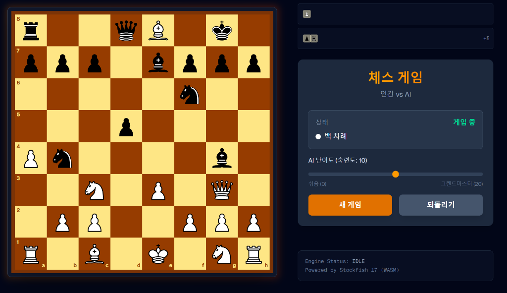

# React + TypeScript + Next.js 체스 게임



## 📖 프로젝트 개요
**React**, **Next.js**, **TypeScript**로 제작된 체스 애플리케이션입니다. 이 프로젝트는 **Stockfish** 체스 엔진을 활용하여 "인간 vs AI" 게임플레이를 구현합니다.


## ✨ 주요 기능
-   **🤖 강력한 AI 상대**: Web Workers를 통해 통합된 **Stockfish 17 (WASM)**로 반응성 뛰어나고 도전적인 상대를 제공합니다.
-   **🎚️ 난이도 조절**: 모든 실력의 플레이어에 맞춘 동적 난이도 슬라이더 (스킬 레벨 0-20).
-   **🖱️ 드래그 앤 드롭 플레이**: `react-dnd`를 사용한 부드러운 기물 이동과 합법적인 수 검증.
-   **🛡️ 이동 검증**: `chess.js`를 사용한 실시간 로직 엔진으로 모든 체스 규칙(캐슬링, 앙파상, 프로모션)을 적용.
-   **🏳️ 잡은 기물 & 점수**: 잡은 기물을 시각적으로 표시하고 실시간 기물 점수 우위(예: +5)를 보여줍니다.
-   **📝 게임 기록 & 실행 취소**: 전체 이동 기록을 추적하며 무르기(Undo) 기능을 통해 전략을 다시 시도할 수 있습니다.
-   **🎨 반응형 UI**: **Tailwind CSS**로 구축된 세련된 다크 테마 인터페이스, 이동 강조 및 포획 표시 기능 포함.

## 🛠️ 기술 스택


## 🚀 기술적 구현 상세

### 아키텍처 (Architecture)
이 프로젝트는 **관심사의 분리 (Separation of Concerns)** 원칙을 철저히 따릅니다.
- **Custom Hooks**: `useChessGame`은 체스 규칙과 상태 관리를, `useStockfish`는 AI 엔진과의 통신을 전담합니다. 이를 통해 UI 컴포넌트(`ChessBoard`, `GameControls`)는 순수하게 렌더링에만 집중할 수 있습니다.
- **상태 관리**: 복잡한 게임 상태(FEN 문자열, 이동 기록, 포획된 기물 등)를 React의 `useState`와 `useReducer` 패턴으로 효율적으로 관리합니다.

### AI 통합 (Stockfish & Web Workers)
브라우저의 메인 스레드 성능 저하를 방지하기 위해 **Web Workers**를 활용합니다.
- **비동기 통신**: Stockfish 엔진은 별도의 스레드에서 실행되며, 메인 스레드와 `postMessage`를 통해 비동기적으로 데이터를 주고받습니다.
- **WASM 성능**: WebAssembly로 컴파일된 Stockfish를 사용하여 네이티브에 준하는 연산 속도를 제공, 깊은 탐색 깊이(Search Depth)에서도 빠른 응답성을 보장합니다.

### 게임 로직 (Game Logic)
`chess.js` 라이브러리를 기반으로 엄격한 체스 규칙을 적용합니다.
- **이동 검증**: 사용자의 드래그 앤 드롭 동작 시 실시간으로 합법적인 수(Legal Move)인지 검증합니다.
- **특수 규칙**: 캐슬링(Castling), 앙파상(En Passant), 프로모션(Promotion) 등 모든 특수 규칙을 완벽하게 지원합니다.

### 성능 최적화 (Performance)
- **React.memo & useCallback**: 체스 보드의 각 칸(`ChessSquare`)과 기물은 잦은 리렌더링이 발생할 수 있는 부분입니다. 이를 `React.memo`로 감싸고 핸들러 함수를 `useCallback`으로 최적화하여 불필요한 렌더링을 최소화했습니다.
- **동적 가져오기**: 무거운 라이브러리나 컴포넌트는 필요 시점에 로드하여 초기 로딩 속도(FCP)를 개선했습니다.

### TypeScript 활용
- **엄격한 타입 시스템**: `interface`와 `type`을 활용하여 게임 상태, 엔진 메시지, 컴포넌트 Props의 타입을 명확히 정의했습니다. 이는 런타임 오류를 사전에 방지하고 코드의 안정성을 높입니다.

## 📁 프로젝트 구조
```
chess-next/
├── app/                  # Next.js App Router 페이지
├── components/           # React UI 컴포넌트 (ChessBoard, Controls 등)
├── hooks/                # 커스텀 훅 (useChessGame, useStockfish)
├── public/               # 정적 에셋 및 Stockfish WASM 파일
└── ...
```

## 🤝 기여하기
기여는 언제나 환영합니다! 편하게 Pull Request를 제출해 주세요.

---
*Built with ❤️ by Lim Jea Hun*
